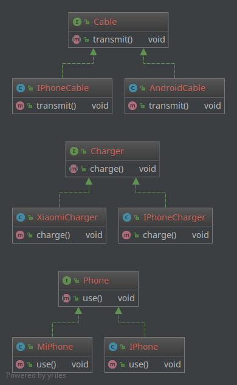
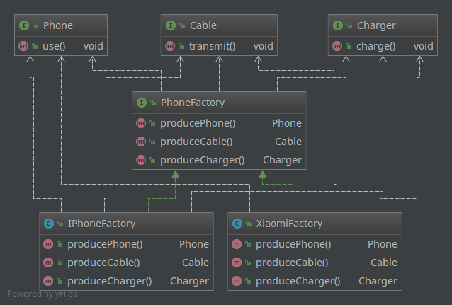

抽象工厂模式是在 [工厂方法模式](../factory-method) 之上的有一次升级，以便能够处理更加复杂的对象创建场景。因此也是所有形态的工厂模式中最为抽象和最具一般性的一种形态。

有朋友可能会想了， [工厂方法模式](../factory-method) 已经是对 [简单工厂模式](../simple-factory) 的具体工厂类做了抽象了（增加了抽象工厂），那抽象工厂模式的“抽象”是什么意思呢？用来处理什么问题呢？

其实无论是 [简单工厂模式](../simple-factory) ，还是 [工厂方法模式](../factory-method) ，在涉及到“产品组装”的时候就变得吃力了。比如大家买手机的时候，除了手机本身，还有充电器、数据线等。苹果手机只能使用苹果的充电线，Android手机也有不同型号的充电线，充电器也需要根据手机选择不同的功率适配的型号。

如果还使用 [简单工厂模式](../simple-factory) 或者 [工厂方法模式](../factory-method) ，那么只能将手机、充电器和数据线看作一个产品给出，这还勉强能hold住。如果涉及到更加复杂的情况，比如组装电脑，从CPU、主板、内存、显卡到机箱、电源等等，各种品牌和型号，还有各个组件的兼容性，其可能的组合成千上万，每一个组合都实现一个具体的工厂类，想想都要呵呵了。

所以，对于“组装”或有“产品族“概念的产品，需要进一步进行抽象。

# 例子

多说无益，还是以刚才手机的例子来动手写写代码看看。

假设小明开了一家手机店，主营两款产品，iPhone和小米手机。我们知道这两种手机的数据线和充电器是不能混用的。

还是图比较清楚，就不贴代码了，源码见本文开头给出的地址。无论是`use()`、`charge()`还是`transmit()`其实都是打印一句话，说明是什么手机、充电器和数据线。

无论是小米手机还是苹果手机，亦或是其他手机，消费者拿到手的都是一个盒子，里边包含手机、充电器和数据线。那么做手机的工厂应该至少具备生产手机、充电器和数据线的能力，既然是“能力”，那么就用接口或抽象类来约束。

PhoneFactory.java

    public interface PhoneFactory {
        Phone producePhone();
        Cable produceCable();
        Charger produceCharger();
    }

那么对于苹果和小米工厂来说，具体生产时就实现这个接口的方法就可以了，同时实现方法的时候，也保证了自己生产的数据线和手机是适配的。

IPhoneFactory.java

    public class IPhoneFactory implements PhoneFactory {
        public Phone producePhone() {
            return new IPhone();
        }
    
        public Cable produceCable() {
            return new IPhoneCable();
        }
    
        public Charger produceCharger() {
            return new IPhoneCharger();
        }
    }

XiaomiFactory.java

    public class XiaomiFactory implements PhoneFactory {
        public Phone producePhone() {
            return new XiaomiPhone();
        }
    
        public Cable produceCable() {
            return new AndroidCable();
        }
    
        public Charger produceCharger() {
            return new XiaomiCharger();
        }
    }

具体在使用这个设计模式的时候，就很灵活了，比如最简单的：

Client.java

    public class Client {
        public static void main(String[] args) {
            PhoneFactory factory = new IPhoneFactory();
            factory.produceCable().transmit();
            factory.produceCharger().charge();
            factory.producePhone().use();
        }
    }

产品组件是由具体工厂决定的，使用小米工厂生产的就是小米的手机、数据线和充电器，苹果工厂一样道理。不过这个`Client`实在太过简单，具体的场景中如果使用，It's your call ! 抽象工厂设计模式的要诀在于“抽象”，具体往下看。

# 总结

这时候我们来看一下类关系图（先把具体产品类抛在一边）：

这里我们一下就明白了为什么这种模式叫做“抽象工厂”模式，相对于 [简单工厂模式](../simple-factory) 和 [工厂方法模式](../factory-method) 来说，抽象工厂的作用是将“抽象组件”组合成“抽象产品”。所以我们看到，`PhoneFactory`的产出是一个一个的接口。所以，** 抽象工厂并不关心具体组件的实现，而是只关心接口**。

“抽象工厂模式”的“抽象”并非是说有抽象的工厂接口，而是说工厂的产出面向的是抽象的产品。

我们再来看一下“开闭原则”的支持：
1. 当增加新的产品族时，比如增加OPPO和VIVO的手机产品，现有的代码均不需要修改，所以支持对扩展开放和对修改关闭；
2. 但是当产品族中增加组件的时候，比如国家规定所有的手机类产品均需要附加一片屏幕保护膜，那么抽象工厂接口和所有的具体工厂类均需要修改，所以并不能完全满足”开闭原则“的要求。