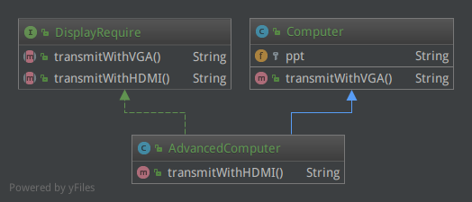
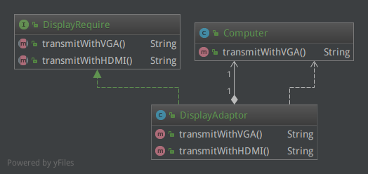

适配器模式（Adapter Pattern）是作为两个不兼容的接口之间的桥梁。这种类型的设计模式属于结构型模式，它结合了两个独立接口的功能。

“适配器”这个词我们平时倒是不少见，比如“电源适配器”，将220V的点转换为电子设备可以接收的小电压的电，可见变压器就是一种“适配器”。不难想到，读卡器是作为内存卡和笔记本之间的适配器，您将内存卡插入读卡器，再将读卡器插入笔记本，这样就可以通过笔记本来读取内存卡。还有我们平时用到的转接头，也是适配器，一端是VGA接口的信号，另一端就可以转换成HDMI的信号。

有时候，这种设计模式也被称为包装（Wrapper）模式。我们平时经常会写或遇到wrapper类，就是同样的作用。

# 例子

就以刚才提到的转接头为例。

今天对小明来说是个重要的日子，因为今天他要面临毕业答辩了。他已经做好了答辩PPT，但是不确定答辩现场的投影仪是VGA接口还是HDMI接口。为了确保万无一失，必须做好两手准备，无论是VGA还是HDMI都要能显示。

DisplayRequire.java

    public interface DisplayRequire {
        String transmitWithVGA();
        String transmitWithHDMI();
    }

现在PPT在自己的老旧笔记本上，这台笔记本只有一个VGA接口。

Computer.java

    public class Computer {
        protected String ppt = "My PPT report";
        public String transmitWithVGA() {
            return ppt;
        }
    }

摆在他面前的有两种选择：

一种是跟舍友借用一下新款的笔记本，这台笔记本在传统VGA接口的基础上，增加了一个HDMI显示接口，能够满足两种显示需求（implements DisplayRequire）：

AdvancedComputer.java

    public class AdvancedComputer extends Computer implements DisplayRequire {
        public String transmitWithHDMI() {
            return this.ppt;
        }
    }

另一种选择就是去商店买一个转接头，可以将VGA信号转换为HDMI和VGA两路信号，只需要接在现在的笔记本上就行：

DisplayAdaptor.java

    public class DisplayAdaptor implements DisplayRequire {
        private Computer computer;
    
        public DisplayAdaptor(Computer computer) {
            this.computer = computer;
        }
    
        public String transmitWithVGA() {
            return this.computer.transmitWithVGA();
        }
    
        public String transmitWithHDMI() {
            return this.computer.transmitWithVGA();
        }
    }

无论选择那种方式，都OK：

Projector.java

    // 借新电脑
    AdvancedComputer advancedComputer = new AdvancedComputer();
    System.out.println(advancedComputer.transmitWithHDMI());
    System.out.println(advancedComputer.transmitWithVGA());

    // 用转接头
    Computer computer = new Computer();
    DisplayAdaptor adapter = new DisplayAdaptor(computer);
    System.out.println(adapter.transmitWithHDMI());
    System.out.println(adapter.transmitWithVGA());

都是可以正常输出的：

    My PPT report
    My PPT report
    My PPT report
    My PPT report

# 总结

以上例子就是适配器模式，这两种方式分别代表“类适配模式”和“对象适配模式”。分别来看：

1.对于“借新电脑”这种方式，就是类适配器模式。当`Computer`无法满足需求的时候，就用一个继承子类（新款电脑）来补充其不足的功能。类关系图如下：

`AdvancedComputer`继承了`Computer`，从而满足了VGA和HDMI的显示需求。

2.对于“用转接头”这种方式，就是对象适配器模式。使用一个将`Computer`对象最为适配器的一个属性，并补充`Computer`本身不足的功能。类关系图如下：

总之，通过继承或依赖的方式，补充现有类功能的不足，使得扩展后的功能能够满足接口需要。因此可以看出，适配器通常不是在最初设计时使用的，而是解决正在服役的项目的问题，在不破坏现有类的基础上，对其进行进一步包装，（就像本文开头所说）因此也叫做包装模式，大家在读源码的时候，如果碰到`XxxxWrapper`不妨先看看，是不是适配器模式。