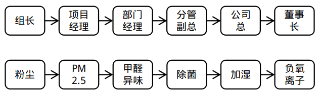
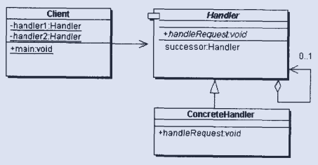
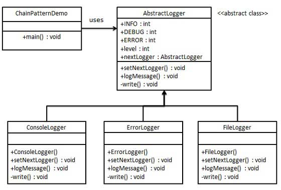

责任链模式（Chain of Responsibility Pattern）中，通常每个接收者都包含对另一个接收者的引用。如果一个对象不能处理该请求，那么它会把相同的请求传给下一个接收者，依此类推。这种类型的设计模式属于行为型模式。

# 例子

话不多说，先看下边两个图：

相信你一眼就明白了，没错，这就是责任链模式的现实场景。
1. 第一个是公司内的责任链图，作为基层员工，许多事情要请示。有些事情组长就可以做主，有些事情要部门经理才能批准，但是作为基层员工通常不会直接越级找部门经理，而是通过上级层层上报。
2. 第二个是空气净化器的净化流程，先过滤大颗粒粉尘，然后是小颗粒PM2.5，然后是吸附甲醛和异味物质...

这两个例子有些明显的区别：
1. 第一个例子，每个环节并不一定要做具体处理，有的直接转给下一个环节去处理；而第二个例子，每个环节都会做相应处理。
2. 第一个例子，到具体执行环节处理完后，就不会再向下一个节点流转；而第二个例子，空气要做过每层过滤处理最终才能出来。

这两种其实都是责任链模式。也就是责任链模式不care上述这些（白眼，那你说这么多，浪费哥的宝贵时间）。**责任链模型关注于单个环节，而不是整体流程**。

这是我直接从《Java与模式》中截的图，看到这里是不是有种“链表”的既视感，要想做成“链”，每个节点就要有下一个节点的引用，然后每个节点有相应的处理方法，好啦，齐活啦～那么流程链呢，由外部业务逻辑去实现就OK了。

下面这个具体的代码例子，我也是拿来主义，哈哈，不是今天偷懒，而是感觉这个例子挺好，来自[菜鸟教程的关于日志的例子](http://www.runoob.com/design-pattern/chain-of-responsibility-pattern.html)。

我们做应用程序离不开日志，日志有多个等级，通常从高到低有ERROR、WARN、INFO、DEBUG等。
1. 日志记录的时候设置的等级越低，那么就会记录越多的日志。比如要求日志记录到DEBUG级，那么ERROR、WARN、INFO、DEBUG这些日志都会打印出来；如果要求日志记录到WARN级，那么只打印出ERROR和WARN级别的日志。
2. 日志打印在哪呢，有标准输出、标准错误、文件等不同的输出流。这些输出流可以设置不同的日志级别，就像上一条那样。

背景介绍完，可以看代码了～

抽象类 AbstractLogger带有详细的日志记录级别。然后创建三种类型的记录器，都扩展了AbstractLogger。每个记录器消息的级别是否属于自己的级别，如果是则相应地打印出来，否则将不打印并把消息传给下一个记录器。

创建抽象的记录器类`AbstractLogger`，`ConsoleLogger`、`ErrorLogger`和`FileLogger`是扩展了的具体记录器类。它们就是不同的责任链节点，根据自己的日志记录级别打印出日志。

拿来主义的代码就不贴了哈，可以看一下[这个链接](http://www.runoob.com/design-pattern/chain-of-responsibility-pattern.html)。

# 总结

关于责任链模式想必你有了一个感性的认识，我不喜欢在文章中罗列设计模式的各种角色、使用场景、优点、缺点，感性的理解最重要，说到底对设计模式的理解是对面向对象设计原则的理解。一方面，设计模式不仅仅是这23种，另一方面，具体某种设计模式在使用时也会有不同变化，不同的设计模式也可以结合使用。

因此设计模式要抓住特征，就像美术功底不高的人素描画人物我们觉得不像，但是画简笔画的人抓住特征画出来的动漫大头人形象，我们一看就知道这是谁。一样的道理。

责任链模式的特征就在于“链”。如何实现这个链呢，就是通过节点“接力”，每个节点指定好下个节点，这样串起来就好。像流水线一样，各个节点处理自己分内的工作。

好处也是显而易见的，就像流水线，如果增加了一道工具，那么接在合适的流程位置即可，对于责任链模式来说没有任何影响，因为流水线的构造是由业务逻辑定义的。

责任链模式在许多我们熟知的Java框架或技术中都有应用。
1. 写过Servlet的同学肯定对`Filter`都有印象，我们可以定义多个Filter，这些Filter串起来就是一个“FilterChain”，来自浏览器的请求过来之后，首先经过层层Filter处理，然后到达映射的Servlet，感觉是不是有点像“空气过滤器”啊？
2. Tomcat中也应用到了责任链模式，这个可能有些同学不太清楚。Tomcat是一个Servlet容器的实现，我们编写的Servlet就是用这个容器托管起来了，请求进来之后，由Tomcat接管，然后转交给具体Servlet处理，然后再有Tomcat将处理反馈发送回去。
  * 其实这个容器是由一层层的类似于“俄罗斯套娃”的容器嵌套而成的，配置过Tomcat的server.xml的同学可能有印象，标签层级是`<Server><Service><Engine><Host><Context></Context></Host></Engine></Service></Server>`我们的应用程序作为`<Context>`是配置在最里边的。
  * 那么请求进来之后，如果经过层层套娃到达最里边的<Context>也就是我们的应用呢？就是用的责任链模式，从Engine到Host再到Context一直到Wrapper（是的，还有一层套娃。。。）都通过一个链传递请求。
