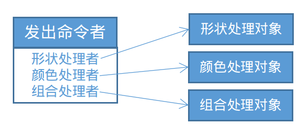
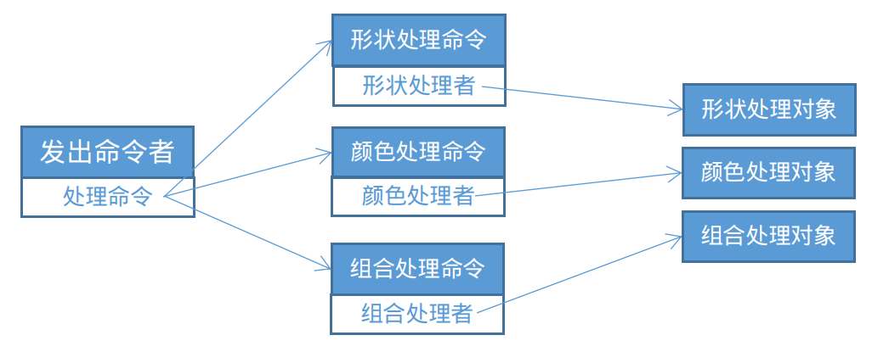

命令模式（Command Pattern）是一种数据驱动的设计模式，它属于行为型模式。请求以命令的形式包裹在对象中，并传给调用对象。调用对象寻找可以处理该命令的合适的处理对象，并把该命令传给这个处理对象，该处理对象执行命令。

命令模式把发出命令的责任和执行命令的责任分开，委派个不同的对象。什么情况下需要吧发出命令的责任和执行命令的责任分开呢？不好意思，按照我的尿性，又要搬出画图的例子了。

# 例子

我们先考虑发出命令和执行命令耦合起来的情况，看有啥不好。比如画图有如下几个命令：画形状、填充颜色、组合形状等，每个操作命令的执行由不同的对象来实现。当用户在执行不同的操作的时候，画图软件有个统一的逻辑来处理：

    // 以下逻辑位于“命令发出者”的方法内：
    if(要画形状){
        形状处理对象.画形状("圆形");
    }
    if(要填充颜色){
        颜色处理对象.填充颜色("红色");
    }
    if(要组合形状){
        组合处理对象.组合形状([]{"红色圆形","蓝色矩形","黄色三角形");
    }

这里有几个不太灵活的地方：
1. “命令发出者”要同所有的“命令执行者”维持关系（前者要有后者的所有引用），只要增加一种命令执行者，就需要修改命令发出者的代码逻辑，显然不符合“开闭”原则的吧；尤其是命令发出者如果是不开放修改的（比如位于框架中），就很难保证扩展性了；
2. 命令执行有可能失败，或者Ctrl+Z回退，这种操作显然是经常遇到的，对于”命令发出者“的逻辑复杂度来说，显然又是雪上加霜。

我们再来看一下，应用命令模式如何解耦以及解耦后有什么好处。

将发出命令和执行命令解耦，即“发出命令者”不直接调用“执行命令者”的方法，而是通过一个“中间媒介”，这个“中间媒介”就是“命令”。从而由原来的**“发出命令者 - 执行命令者”**的关系变成**“发出命令者 - 命令 - 执行命令者”**。

“发出命令者”只关心命令的执行，并不关心由谁来执行。从而它手中不再握有一系列的“执行命令者”的引用，而是只有处理命令（或命令集合，如命令队列）的引用。而命令本身有“执行命令者”的引用，从而知道找谁去完成命令的具体执行。

当然，要做到完全解耦和保证灵活性，必须针对“命令”进行面向接口的设计，也就是“发出命令者”手里的只有抽象类型的命令对象，才能做到“不care”。这都是设计模式的老掉牙的套路了，不再多说。

如此，刚才提到的两个不太灵活的问题也就迎刃而解了。看代码喽～

发出命令者 DrawingApp.java

    public class DrawingApp {
        private List<Command> commands = new ArrayList<Command>();
        public void takeCommand(Command command) {
            commands.add(command);
        }
        public void CommandsDone() {
            for (Command command:commands) {
                command.doCmd();
            }
        }
        public void undoLastCommand() {
            commands.get(commands.size() - 1).undoCmd();
        }
    }

看到它引用了命令的列表。

命令抽象 Command.java

    public interface Command {
        void doCmd();
        void undoCmd();
    }
    
具体命令 ShapeDrawing.java

    public class ShapeDrawing implements Command {
        private ShapeDrawer drawer;
        private String arg;
    
        public ShapeDrawing(ShapeDrawer drawer, String arg) {
            this.drawer = drawer;
            this.arg = arg;
        }
    
        public void doCmd() {
            drawer.drawShape(arg);
        }
    
        public void undoCmd() {
            drawer.undrawShape();
        }
    }

具体命令 ColorFilling.java

    public class ColorFilling implements Command {
        private ColorFiller filler;
        private String arg;
    
        public ColorFilling(ColorFiller filler, String arg) {
            this.filler = filler;
            this.arg = arg;
        }
    
        public void doCmd() {
            filler.fillColor(arg);
        }
    
        public void undoCmd() {
            filler.unfillColor();
        }
    }

两个具体命令都引用了相应的命令执行者。

执行命令者 ShapeDrawer.java

    public class ShapeDrawer {
        public void drawShape(String shape) {
            System.out.println("画了一个" + shape);
        }
        public void undrawShape() {
            System.out.println("撤销刚才画的形状");
        }
    }

执行命令者 ColorFiller.java

    public class ColorFiller {
        public void fillColor(String color) {
            System.out.println("填充" + color);
        }
        public void unfillColor() {
            System.out.println("撤销填充的颜色");
        }
    }

测试一下，发出三个命令，并撤销最后一个：

Client.java

    public class Client {
        public static void main(String[] args) {
            DrawingApp app = new DrawingApp();
            ShapeDrawer shapeDrawer = new ShapeDrawer();
            ColorFiller colorFiller = new ColorFiller();
            Command drawCircle = new ShapeDrawing(shapeDrawer, "圆形");
            Command fillRed = new ColorFilling(colorFiller, "红色");
            Command drawRectancle = new ShapeDrawing(shapeDrawer, "矩形");
            app.takeCommand(drawCircle);
            app.takeCommand(fillRed);
            app.takeCommand(drawRectancle);
            app.CommandsDone();
            app.undoLastCommand();
        }
    }

输出如下：

    画了一个圆形
    填充红色
    画了一个矩形
    撤销刚才画的形状

# 总结
通过以上例子，我们可以总结出命令模式的特点：
1. 将命令封装为对象作为传递媒介；
2. 命令发出者（invoker）和命令执行者（receiver）是解耦的，通过命令对象“牵线”，invoker维护有命令（或命令集合）的引用，命令中有receiver的引用。

命令模式的应用场景([转载](http://blog.csdn.net/zdsicecoco/article/details/51332440)）：
1. Multi-level undo（多级undo操作）。如果系统需要实现多级回退操作，这时如果所有用户的操作都以command对象的形式实现，系统可以简单地用stack来保存最近执行的命令，如果用户需要执行undo操作，系统只需简单地popup一个最近的command对象然后执行它的undo()方法既可。 
2. Transactional behavior（原子事务行为）。借助command模式，可以简单地实现一个具有原子事务的行为。当一个事务失败时，往往需要回退到执行前的状态，可以借助command对象保存这种状态，简单地处理回退操作。 
3. Progress bars（状态条）。假如系统需要按顺序执行一系列的命令操作，如果每个command对象都提供一个getEstimatedDuration()方法，那么系统可以简单地评估执行状态并显示出合适的状态条。 
4. Wizards（导航）。通常一个使用多个wizard页面来共同完成一个简单动作。一个自然的方法是使用一个command对象来封装wizard过程，该command对象在第一个wizard页面显示时被创建，每个wizard页面接收用户输入并设置到该command对象中，当最后一个wizard页面用户按下“Finish”按钮时，可以简单地触发一个事件调用execute()方法执行整个动作。通过这种方法，command类不包含任何跟用户界面有关的代码，可以分离用户界面与具体的处理逻辑。 
5. GUI buttons and menu items（GUI按钮与菜单条等等）。Swing系统里，用户可以通过工具条按钮，菜单按钮执行命令，可以用command对象来封装命令的执行。 
6. Thread pools（线程池）。通常一个典型的线程池实现类可能有一个名为addTask()的public方法，用来添加一项工作任务到任务队列中。该任务队列中的所有任务可以用command对象来封装，通常这些command对象会实现一个通用的接口比如java.lang.Runnable。 
7. Macro recording（宏纪录）。可以用command对象来封装用户的一个操作，这样系统可以简单通过队列保存一系列的command对象的状态就可以记录用户的连续操作。这样通过执行队列中的command对象，就可以完成"Play back"操作了。 
8. Networking。通过网络发送command命令到其他机器上运行。 
9. Parallel Processing（并发处理）。当一个调用共享某个资源并被多个线程并发处理时。 