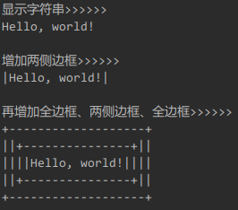
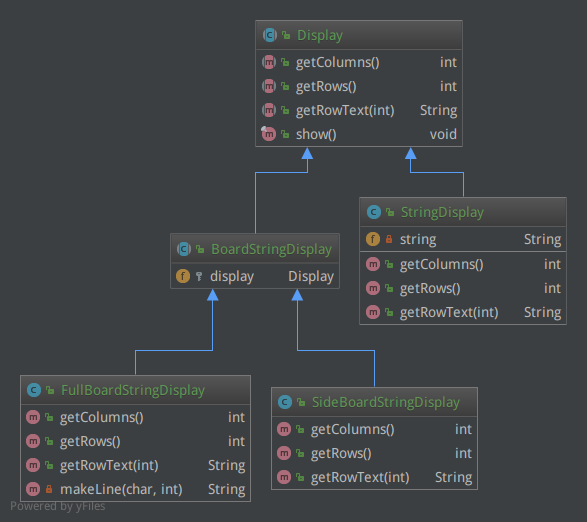

装饰器模式（Decorator Pattern）以客户端透明的方式扩展对象的功能。这种类型的设计模式属于结构型模式，它是作为现有的类的一个包装，是继承关系的一个替代方案。

说到装饰者模式，估计大家都不陌生，Java I/O的设计就是采用了装饰者模式。想必初学Java I/O的时候大家都经历过一段“懵逼”期，各种`InputStream`和`OutputStream`层层嵌套，感觉就像洋葱，如果给装饰者一个形象化的吉祥物，想必非洋葱莫属。

# 例子

这里装饰者的例子就直接拿来主义了，因为《图解设计模式》这本书中的例子比较形象。

这个例子的功能是给文字增加装饰边框。通过不同的装饰类实现不同的边框效果。

比如，我有个字符串“Hello, world!”，我想在两侧加上边框，那么就显示为

    |Hello, world!|

如果我想在上下左右均加上边框，那么就显示为

    +-------------+
    |Hello, world!|
    +-------------+

并且可以一层层嵌套：

    +---------------+
    |+-------------+|
    ||Hello, world!||
    |+-------------+|
    +---------------+

怎么样，是不是很像洋葱啊？

总体来说，还是字符显示的问题，通过一个抽象类`Display`来定义。

Display.java

    public abstract class Display {
        public abstract int getColumn();
        public abstract int getRows();
        public abstract String getRowText(int row);
        public final void show() {
            for (int i = 0; i < getRows(); i++) {
                System.out.println(getRowText(i));
            }
        }
    }

其中`show()`方法将所有行的内容显示出来。那么对于没有任何边框的文字显示来说：

StringDisplay.java

    public class StringDisplay extends Display {
        private String string;
    
        public StringDisplay(String string) {
            this.string = string;
        }
    
        public int getColumn() {
            return string.getBytes().length;
        }
    
        public int getRows() {
            return 1;
        }
    
        public String getRowText(int row) {
            if (row == 0) {
                return string;
            } else {
                return null;
            }
        }
    }

因为只有一行，所以`getRows()`返回1。我们再来看一下边框装饰后的文本：

BoardStringDisplay.java

    public abstract class BoardStringDisplay extends Display {
        protected Display display;
        protected BoardStringDisplay(Display display) {
            this.display = display;
        }
    }

SideBoardStringDisplay.java

    public class SideBoardStringDisplay extends BoardStringDisplay {
    
        protected SideBoardStringDisplay(Display display) {
            super(display);
        }
    
        public int getColumns() {
            return 1 + display.getColumns() + 1;    // 文字两侧各增加一个字符
        }
    
        public int getRows() {
            return display.getRows();               // 行数不变
        }
    
        public String getRowText(int row) {
            return "|" + display.getRowText(row) + "|";
        }
    }

FullBoardStringDisplay.java

    public class FullBoardStringDisplay extends BoardStringDisplay {
    
        protected FullBoardStringDisplay(Display display) {
            super(display);
        }
    
        public int getColumns() {
            return 1 + display.getColumns() + 1;
        }
    
        public int getRows() {
            return 1 + display.getRows() + 1;
        }
    
        public String getRowText(int row) {
            if (row == 0 || row == display.getRows() + 1) {
                return "+" + makeLine('-', display.getColumns()) + "+";
            } else  {
                return "|" + display.getRowText(row - 1) + "|";
            }
        }
    
        private String makeLine(char ch, int count) {
            StringBuffer buf = new StringBuffer();
            for (int i = 0; i < count; i++) {
                buf.append(ch);
            }
            return buf.toString();
        }
    }

试一下洋葱效果：

Client.java

    public class Client {
        public static void main(String[] args) {
            Display d1 = new StringDisplay("Hello, world!");
            Display d2 = new SideBoardStringDisplay(d1);
            Display d3 = new FullBoardStringDisplay(
                            new SideBoardStringDisplay(
                                new FullBoardStringDisplay(d2)));
            System.out.println("显示字符串>>>>>>");
            d1.show();
            System.out.println("\n增加两侧边框>>>>>>");
            d2.show();
            System.out.println("\n再增加全边框、两侧边框、全边框>>>>>>");
            d3.show();
        }
    }

输入如下：

# 总结

这个例子的代码量比以前的多一些，但是思路并不复杂。

这里，`StringDisplay`是被装饰者，`SideBoardStringDisplay`和`FullBoardStringDisplay`是装饰器，同时也能够被装饰，因为说到底，它们都是继承自`Display`，所以可以层层嵌套，不断增强。

我们再回头看装饰器模式的特点：
1. **接口透明，在不改变被装饰者的前提下增加功能**。无论是装饰器还是被装饰者，都有共同的抽象，也许是继承同一个抽象类，也许是实现同一个接口；如此一来，装饰前后的对象都是对外提供同样的服务。就像生日蛋糕，无论是装饰了草莓、还是慕斯、还是巧克力，都还是蛋糕，不会变成一块披萨。
2. **使用了委托**装饰器将被装饰的对象作为成员，使得类之间称为弱关联关系，这一点和桥接模式的出发点是一致的。草莓点缀在生日蛋糕上是草莓生日蛋糕，点缀在披萨上是水果披萨，客人不能抢了主人风头。这里和代理模式有些类似，主要区别在于应用场景和目的，装饰器模式应当为所装饰的对象提供增强功能，而代理模式对被代理的对象施加控制，并不提供对对象本身的增强。

各种装饰器并非一定要有一个抽象（本例中的`BoardStringDisplay`），直接装饰`StringDisplay`也是OK的，这个并不是装饰器模式的特点，只是具体使用时看是否有进一步抽象的需要。