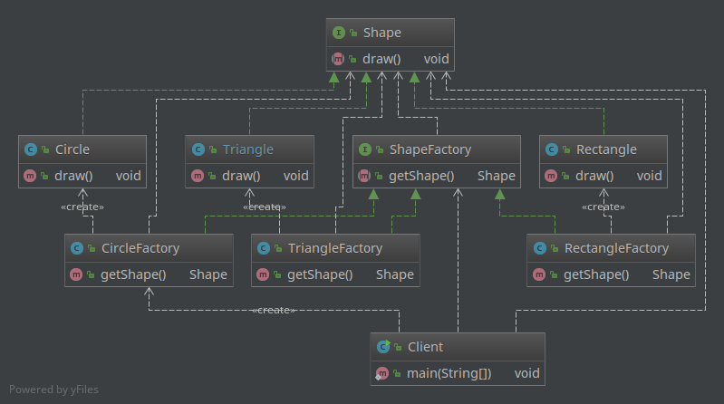
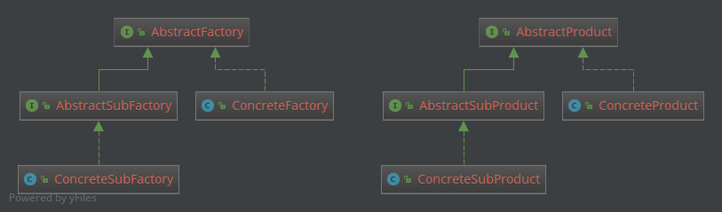

工厂方法模式同 [简单工厂模式](../simple-factory) 一样，也是创建类模式，又叫做虚拟构造（Virtual Constructor）模式或多态工厂(Polymorphic Factory）模式。其用意是定义一个创建产品对象的工厂接口，将实际创建工作推迟到子类中。

上篇说到， [简单工厂模式](../simple-factory) 并未做到完全的“开闭原则”。回顾一下，“开”即对扩展开放，这点是没错的， [简单工厂模式](../simple-factory) 的初衷之一就是方便增加“产品类型”的时候；“闭”即对修改关闭，这点其实并未做到，当需要增删改“产品类型”的时候，工厂类必须要修改，因为工厂类“知道”如何创建所有的产品类型的对象。

那么工厂方法模式就是为了完全满足“开闭原则”，即在 [简单工厂模式](../simple-factory) 的基础上，做到当增加产品类型的时候，无需改动现有的代码。继续用上篇的例子：

# 例子

仍然是做一个画图软件，可以画矩形、三角形和圆形等，每一种图形都用一个类来管理：  
  * `Rectangle`
  * `Circle`
  * `Triangle`
每个类都有各自的`draw()`方法，共同实现`Shape`接口。

Shape.java

    public interface Shape {
       void draw();
    }

Rectangle.java

    public class Rectangle implements Shape {
       @Override
       public void draw() {
          System.out.println("Draw a rectangle.");
       }
    }

Triangle.java

    public class Triangle implements Shape {
       @Override
       public void draw() {
          System.out.println("Draw a triangle.");
       }
    }

Circle.java

    public class Circle implements Shape {
       @Override
       public void draw() {
          System.out.println("Draw a circle.");
       }
    }

以上几个类都没有变化，有变化的是工厂类，工厂类也采用基于接口的设计，由不同的具体工厂类负责相应对象的创建：

ShapeFactory.java

    public interface ShapeFactory {
        Shape getShape();
    }

RectangleFactory.java

    public class RectangleFactory implements ShapeFactory {
        public Shape getShape() {
            return new Rectangle();
        }
    }

CircleFactory.java

    public class CircleFactory implements ShapeFactory{
        public Shape getShape() {
            return new Circle();
        }
    }

Triangle.Factory.java

    public class CircleFactory implements ShapeFactory{
        public Shape getShape() {
            return new Circle();
        }
    }

那么在需要某个形状的时候，就通过相应的具体工厂类创建即可：

Client.java

    public class Client {
        public static void main(String[] args) {
            ShapeFactory factory = new CircleFactory();
            Shape c = factory.getShape();
            c.draw();
        }
    }

再来看一下类图：

与 [简单工厂模式](../simple-factory) 对比以下：

区别就在于 [简单工厂模式](../simple-factory) 下的一个具体的工厂类转换成了基于接口`ShapeFactory`的三个具体工厂类。

好处也是明显的：当增加一个新的形状类型的时候，不需要对现有代码做任何更改，增加一个相应的实现了`ShapeFactory`的具体工厂类即可。可见，工厂方法模式能够完全做到“开闭原则”。

这个例子仍然是不恰当的，因为无论如何这一套模式设计比原始的实现方式有更加复杂了。所以再次赘述一遍注意事项，以上例子是为了说明工厂方法模式，但并不是一个合理的应用。**复杂对象适合使用工厂模式，而简单对象，特别是只需要通过 new 就可以完成创建的对象，无需使用工厂模式。如果使用工厂模式，就需要引入一个工厂类，会增加系统的复杂度。**

# Java中的应用
下边看一下合理的应用场景是如何的，在Java中的实际应用的例子（来自《Java与模式》）：

** 1. Java聚集中的应用 **

Java聚集是一套设计精良的数据结构实现，主要的Java聚集都实现自`java.util.Collection`接口，这个接口的父接口`Iterable`规定所有的Java聚集都必须提供一个`iterator()`方法，返还一个`Iterator`类型的对象：

java.lang.Iterable.java

    public interface Iterable<E> {
        ... ...
        Iterator<E> iterator();
        ... ...
    }

ArrayLis是我们常用的一个Collection实现类，其iterator()方法实现如下：

java.util.ArrayList.java

    public class ArrayList<E> extends AbstractList<E>
            implements List<E>, RandomAccess, Cloneable, java.io.Serializable {
        ... ...
        // 实现iterato接口，返回一个Iterator对象
        public Iterator<E> iterator() {
            return new Itr();
        }
        private class Itr implements Iterator<E> {
        ... ...
        }
        ... ...
    }

可见，`ArrayList`类的`iterator()`方法就是一个具体工厂类的工厂方法，而`Collection`就是一个抽象工厂。除了`ArrayList`还有`LinkedList`等等具体实现类。

# 总结

从上边的例子可以看到，工厂方法模式其实是将“面向接口”编程的思路应用在了工厂类上，这样有几个方便的地方：

1. 做到了完全的“开闭原则”，因为增加新的“产品”和相应的“工厂”均不需修改现有代码；
2. 工厂设计模式通常应用在复杂的对象创建场景中，因此面临多层的继承关系，比如`ArrayList`实现了`List`接口，而后者继承自`Collect`接口，`Collect`又继承自`Iterator`接口。有时候具体工厂方法与具体产品是有层次对应关系的，比如：

这种情况也是只有一个工厂类的 [简单工厂模式](../simple-factory) 所无法满足的。
