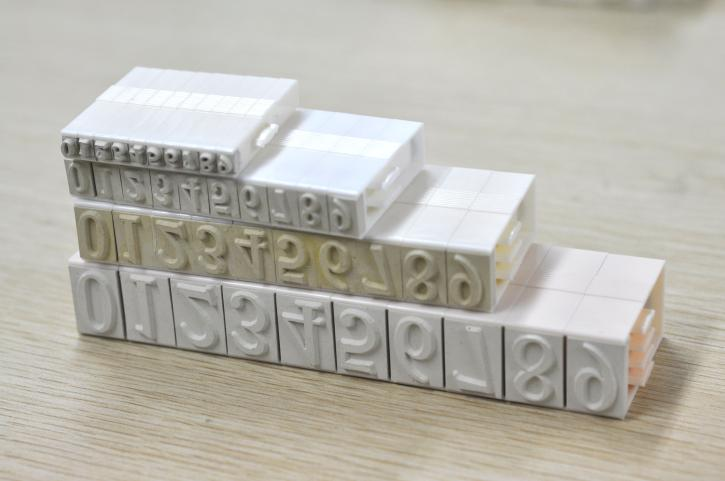
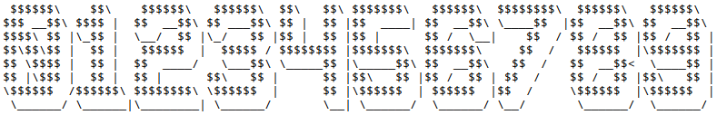
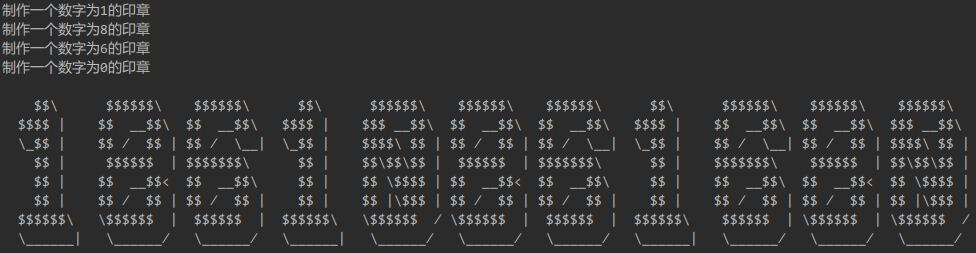

享元模式（Flyweight Pattern）以共享的方式支持大量的细粒度的对象。尝试重用现有的同类对象，如果未找到匹配的对象，则创建新对象。从而减少创建对象的数量和内存占用量，提高性能。这种类型的设计模式属于结构型模式。

如果说其他的设计模式从名称还能够直观了解到其具体模式或应用场景，那么这个“享元（Flyweight）”。。。好吧，恕我眼拙，无论中文还是英文，确实一眼看不出它是个什么鬼～

先不管它，猜猜下边这个东西是啥，干啥用的～



想必你已经猜个八九不离十了，这是活字印章，也叫组合印章，可以用在很多需要打印体的纸面材料上面。这可是来自老祖宗的智慧，享元模式可以说跟它有异曲同工之妙。怎么说？

印刷体手写起来很难写，即使能写也好耗费很多时间，用印章模子的方式固定下来，用的时候蘸一下印泥一按就好，省事儿了很多（切！这不是原型模式的思想吗！别急，还没说完～）。如果有人的电话号码是18610861680，那需要做三个1、8和6的印章吗？显然不用，稍微动点脑筋就知道，每次需要印“1”的时候，就用“1”这个印章就好了，其他数字同理。这种对象的复用的思路就跟享元模式比较相似了。

这个例子如果用代码来做如下（本例灵感来自《图解设计模式》的示例程序，以下代码虽同此书不同，但相差不大）。

假设每个印章的印刷体效果如下（[在线生成字符字的网站](http://patorjk.com/software/taag/#p=display&h=0&v=1&f=Big%20Money-nw&t=0123456789)）：



将它们做成10个10×10的字体文件（放到工程项目的resources下），比如`fonts/seal-0.txt`为

```
    
     $$$$$$\
    $$$ __$$\
    $$$$\ $$ |
    $$\$$\$$ |
    $$ \$$$$ |
    $$ |\$$$ |
    \$$$$$$  /
     \______/
     
```

对于数字印章来说，有两个成员变量，一个为数字“0”，还有一个是10行的String[]数组，用来保存以上字体信息。在制作印章（构造方法）的时候就需要指定数字，并从相应的`fonts/seal-n.txt`中读取字体信息。

NumSeal.java

    public class NumSeal {
        private Integer num;
    
        private String[] fontLines;
    
        // 构造方法中读取字体信息
        public NumSeal(Integer num) {
            this.num = num;
            this.fontLines = new String[10];
            try {
                BufferedReader reader = new BufferedReader(new InputStreamReader(getClass().getResourceAsStream("/fonts/seal-" + num + ".txt")));
                String line;
                for (int i = 0; i < 10; i++) {
                    line = reader.readLine();
                    if (line != null) {
                        fontLines[i] = line;
                    } else {
                        break;
                    }
                }
                reader.close();
            } catch (IOException e) {
                e.printStackTrace();
            }
        }
    
        // 按行打印，共10行10列靠左打印
        public void sealPrint(int line) {
            System.out.printf(" %-10.10s", fontLines[line]);
        }
    }

印章工厂，通过维护一个Map，来保证不会重复造出多余的NumSeal对象，实现共享实例的功能，如果没有某个数字的印章，那么现造一个，如果有，就用现有的。

NumSealFactory.java

    public class NumSealFactory {
        private Map<Integer, NumSeal> seals = new HashMap<Integer, NumSeal>(10);
        public NumSeal getSeal(Integer num) {
            NumSeal seal = seals.get(num);
            if (seal == null) {
                seal = new NumSeal(num);
                System.out.println("制作一个数字为" + num + "的印章");
                seals.put(num, seal);
                return seal;
            }
            return seal;
        }
    }

我们在使用组合印章的时候，给定一个数字字符串，比如手机号“18610861680”，然后使用印章将其打印出来：

NumsPrinter.java

    public class NumsPrinter {
        private NumSeal[] seals;
    
        public NumsPrinter(String nums) {
            seals = new NumSeal[nums.length()];
            NumSealFactory numSealFactory = new NumSealFactory();
            for (int i = 0; i < nums.length(); i++) {
                seals[i] = numSealFactory.getSeal(nums.charAt(i) - 48);
            }
        }
    
        public void print() {
            for (int l = 0; l < 10; l++) {
                for (NumSeal seal:seals) {
                    seal.sealPrint(l);
                }
                System.out.println();
            }
        }
    }

这里，使用了印章工厂`NumSealFactory`的实例来获取印章，保证实例共享，并打印出来（由于标准输出玩的不熟，打印的过程是整体按行打印的，跟使用数字印章的时候每个印章打印一下不太一样，不过不影响理解）。

验证一下：

Client.java

    public class Client {
        public static void main(String[] args) {
            new NumsPrinter("18610861680").print();
        }
    }

输出为：



可以看到，总共制作了4个印章，重复的数字1个印章就够了。

# 总结

仍然不给出类关系图和角色说明哈，因为我不是在写教科书。如果你看了这篇文字，之后能够有一个感性的认识，我就倍感荣幸了。还是那句话，设计模式的类关系不是固定的，不在于是用接口还是抽象类做抽象，也不仅仅就是这23个模式，不管黑猫白猫，能抓老鼠就是好猫。设计模式也是同样，世界上本没有设计模式，用的人多了也就有了设计模式，仅此而已。就像上边的例子，`NumSealFactory`和`NumsPrinter`如果合并到一个类里边，仍然是享元模式，因为这个模式的特征不在几个类，如何引用的，而在于：
1. 通过一个“对象池”来维护共享的对象，有则拿出来用，无则创建一个放到池子里以便以后也能随时用。如何维护“对象池”呢，通常用Map这种key-value的集合，有一个工厂类来管理，所以享元模式通常也用到了工厂模式。
2. 提到“对象池”，以及上边例子的`NumSealFactory`，是不是有种似曾相识的感觉。我们在用Hibernate的时候，也有“连接池”，也有“SessionFactory”来获取连接。但是请注意，享元模式的这种对象共享和连接池还不太一样，连接池中的对象都是一致的，取出任何一个连接都可以用来进行CRUD；而享元模式的对象池中的对象是各不相同的，简单理解就是“去重”了，比如上边例子中电话号码”18610861680“去重之后需要”1“、”8“、”6“、”0“四个印章，但是互相之间是不同的”8“的印章印不出6来，如果连接池中的连接都“去重”，那么就剩一个连接了。**所以再回想享元模式，关键字可以是”去重对象池“。**

好处不多说，去重之后，对象数量少了，更加节省内存；对于对象创建起来比较消耗时间和资源的，重用效率更高；当对象发生变化的时候，变一个就好，比如印章6的字体变了，调整一下这个印章对象就可以了。缺点就是代码结构复杂了，因为需要托管对象创建的过程来进行限制。

其实SDK中，有些不变类（final class）就用到了享元模式的思想，比如：
1. String就是一个不变类，JVM中维护了一个字符串池，`a = "abc"; b = "abc"`（基于`String.intern()`方法查看字符串池中的字符串，若有相同的则无需创建直接返回现有字符串）执行后，`a`和`b`使用的是同一个字符串对象（a==b），从而避免创建更多的重复字符串对象，之后用`c = new String("abc")`时，`a`和`c`才不是同一个字符串对象（a!=c）；
2. 原生类型的装箱类型（比如Integer）也是不变类，`Integer`中就也用到”去重对象池“来缓存常用数字的方法：

    public static Integer valueOf(int i) {
        if (i >= IntegerCache.low && i <= IntegerCache.high)
            return IntegerCache.cache[i + (-IntegerCache.low)];
        return new Integer(i);
    }

`low`到`high`通常是-128到127，认为这个区间的Integer对象用的比较多，为避免重复而共享对象：

    
    System.out.println(Integer.valueOf(123) == Integer.valueOf(123));   // true
    System.out.println(Integer.valueOf(1234) == Integer.valueOf(1234)); // false

上边无论是`String.intern()`还是`Integer.valueOf()`，都相当于享元模式中的那个维护对象池的工厂方法。