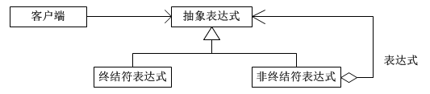

解释器模式（Interpreter Pattern）提供了评估语言的语法或表达式的方式，它属于行为型模式。这种模式实现了一个表达式接口，该接口解释一个特定的上下文。

解释器模式在我们开发过程中并不常用，是个比较小众的设计模式。这种模式通常被用在 SQL 解析、符号处理引擎等。

什么是符号处理引擎呢？举几个例子，

  * 强大而又令人望而却步的正则表达式，相信大多数程序猿都接触过吧，`[0-9a-zA-Z]+`这样一串符号就能够匹配一个由数字和大小写字母组成的字符串。类似的还有XML文件的解析、SQL语句的解析等等。
  * 假设你做了一个机器人，可以通过指令告诉它如何执行动作，比如向前走10个单位是`forward 10`，向左转是`turn left`，当你输入`begin forward 10 turn left forward 5 end` 组成的命令给它的终端，它就能明白命令的意思（向前走10个单位然后左转走5个单位）并执行。
  * 在举个简单点的例子，正则表达式，我们通常用的计算器是一步一步来的，比如`2+3-4/2=`当输入`+`、`-``/`和`=`的时候都会立即响应。但是还有种计算器，可以在输入整个公式后，一并进行计算，这种计算器可以直接输入`2+3-4/2`然后回车后直接给出整个式子的结果，这种计算器就是“解释型”计算器。
  
就以最后一个计算式的例子来说，`2+3-4/2`可以用如下树形表示：

这就相当于一个“语法树”。多数编程语言在编译源码时或直接解释执行时，通常都会生成类似这样的语法树，不过复杂得多。

在图示的这个语法树中，`2`、`3`、`4`、`2`都是叶子节点，称之为**“终结符表达式”**，因为它们已经不能再进一步展开，就像上边正则表达式的例子中的`09azAZ`。而树中的非叶子节点被称为**“非终结符表达式”**，比如`-`、`+`、`/`，当解释到它们时，还可以展开为子表达式。

对于这种树形结构，最擅长的设计模式那就是**组合模式**了，当然前提是树中的叶子节点和非叶子节点都能够抽象为一种接口。

所以对于表达式的解析和求值来说，就是一个类似递归的过程。无论是叶子节点还是非叶子节点，只要完成自己“份内”的工作即可，那就是返回表达式的值。如果是叶子节点，那么就是它本身；如果是非叶子节点，那么就是表达式计算之后的结果。

所以对于抽象表达式来说，抽象起来就很简单了，有个`interpret()`方法就OK了，返回类型就是一个int型，逻辑就是上一段描述的样子。

Expression.java

    public interface Expression {
        int interpret();
    }

对于叶子节点的数字，也就是终结符表达式来说：

Num.java

    public class Num implements Expression {
        private int number;
    
        public Num(int number) {
            this.number = number;
        }
    
        // 返回值就是数字本身
        public int interpret() {
            return number;
        }
    }

对于非叶子节点的运算符，也就是非终结符表达式来说，都需要一个左值和右值才能进行解析运算：

Add.java

    public class Add implements Expression {
        private Expression left, right;
    
        public Add(Expression left, Expression right) {
            this.left = left;
            this.right = right;
        }
    
        // 返回值是两个子表达式的值相加
        public int interpret() {
            return left.interpret() + right.interpret();
        }
    }

左值`left`和右值`right`都是`Expression`，`interpret()`方法返回值是两个子表达式的值相加。

对于减法`Sub.java`、乘法`Mul.java`和除法`Div.java`也是类似的。

当进行计算时：

Client.java

    public class Client {
        public static void main(String[] args) {
            // 解析 2+3-4/2 的值
            Expression a = new Num(2), b = new Num(3),
                       c = new Num(4), d = new Num(2);
    
            Expression result = new Sub(new Add(a, b), new Div(c, d));
    
            System.out.println(result.interpret());
        }
    }

通过这个例子，我们可以看出：

  1. 解释器模式的本质：分离实现，解释执行。通过一个解释器对象处理一个语法规则的方式，把复杂的功能分离开，然后选择需要被执行的功能，并把这些功能组合成需要解释执行的抽象语法树，再按照抽象语法树来解释执行，实现相应的功能。从本质上看，解释器模式的思路仍然是分离、封装和简化，这与很多其他模式是一样的。
  2. 对于定义好的抽象语法树，解释器来负责解释执行，而选择解释器的工作，在构建抽象语法树的时候就完成了，一般由根结点的解释器开始解释，然后递归地调用其他解释器。

**解释器模式的优缺点**（[引用](https://www.cnblogs.com/5iedu/p/5595153.html)）

优点：

  * 易于实现文法：在解释器模式中，一条语法规则用一个解释器对象来解释执行。对于解释器的实现来讲，功能就变得比较简单，只需要考虑这一条语法规则的实现就可以了，其他的都不用管。
  * 易于扩展新的语法。由于解释器采用类来描述语法规则，因此可以通过继承等机制创建相应的解释器对象，在创建抽象语法树的时候使用这个新的解释器对象就可以了。

缺点：

  * 执行效率较低。由于在解释器模式中使用了大量的循环和递归调用，因此在解释较为复杂的句子时其速度很慢，而且代码的调试过程也比较麻烦。
  * 对于复杂文法难以维护。在解释器模式中，每一条规则至少需要定义一个类，因此如果一个语言包含太多文法规则，类的个数将会急剧增加，导致系统难以管理和维护，此时可以考虑使用语法分析程序等方式来取代解释器模式。

**解释器模式的应用场景**

  1. 当一个语言需要解释执行，并可以将该语言中的句子表示为一个抽象语法树的时候，可以考虑使用解释器模式（如XML文档解释、正则表达式等领域）
  2. 一些重复出现的问题可以用一种简单的语言来进行表达。
  3. 一个语言的文法较为简单.
  4. 当执行效率不是关键和主要关心的问题时可考虑解释器模式（注：高效的解释器通常不是通过直接解释抽象语法树来实现的，而是需要将它们转换成其他形式，使用解释器模式的执行效率并不高。）