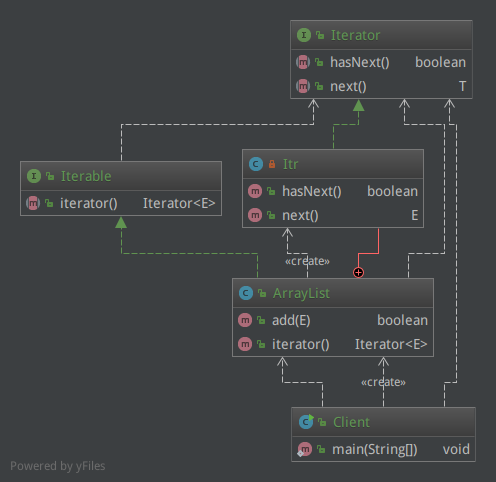

迭代器（Iterator）模式又叫游标（Cursor）模式，通常用于集合类型来提供一种顺序访问其中元素而又不必暴漏集合的内部结构，是一种行为模式。

关于迭代器（Iterator）我想对Java Collection有过接触的同学就不陌生，所以本文也就无需举其他例子了，看一下在Java SDK中是如何实现的就好了。

据统计，`java.util.ArrayList`是Java SDK中使用频率最高的类。有人说程序就是数据结构+算法，可见数据结构的重要性。我们在日常开发中，时常跟Java集合中的各种工具类打交道，对于它们，遍历元素又是家常便饭，比如：

    String[] strings = new String[]{"Hello,", "Java", "Design", "Patterns."};
    List<String> stringList = Arrays.asList(strings);
    Iterator<String> iterator = stringList.iterator();
    while (iterator.hasNext()) {
        System.out.print(iterator.next() + " ");
    }

输出即：

    Hello, Java Design Patterns. 

其中的`Iterator`就是迭代器，它有两个核心方法：

java.util.Iterator.java（不考虑Java8新增内容）

    public interface Iterator<E> {
        boolean hasNext();
        E next();
    }

  * `hasNext()`用于判断是否还有下一个元素；
  * `next()`用于返回下一个元素，同时“看向”这个元素的再下一个元素。

我们常用的一些Java数据结构工具：

`Collection`是继承自`Iterable`，而后者的核心方法就是返回`Iterator`实例的`iterator()`方法（不考虑Java8增加的内容的话）：

java.lang.Iterable.java

    public interface Iterable<T> {
        Iterator<T> iterator();
    }

所以我们平时使用的各种不同的`List`、`Set`和`Queue`的具体实现，都能返回迭代器以便能够对它们中的元素进行遍历。

以`java.util.ArrayList`为例，它的`iterator()`方法返回的是`Iterator`的其内部类的实现：

java.util.ArrayList.java

    public class ArrayList<E> extends AbstractList<E>
            implements List<E>, RandomAccess, Cloneable, java.io.Serializable {
        
        // 实际存储元素的数据
        transient Object[] elementData; 
        // 元素实际个数
        private int size;
        
        ... ...
        
        public Iterator<E> iterator() {
            return new Itr();
        }
        
        private class Itr implements Iterator<E> {
            int cursor;       // index of next element to return
            int lastRet = -1; // index of last element returned; -1 if no such
            ... ...
    
            public boolean hasNext() {
                return cursor != size;
            }
    
            @SuppressWarnings("unchecked")
            public E next() {
                ... ...
                int i = cursor;
                if (i >= size)
                    throw new NoSuchElementException();
                Object[] elementData = ArrayList.this.elementData;
                if (i >= elementData.length)
                    throw new ConcurrentModificationException();
                cursor = i + 1;
                return (E) elementData[lastRet = i];
            }
            ... ...
        } //End of Itr
        ... ...
    } //End of ArrayList

其中去掉了一些代码。`ArrayList`是一种数组类型的`List`，其内部采用一个`Object[]`来保存所有元素，`size`用来保存一共有多少个元素。

方法`iterator()`会返回一个内部类`Itr`，后者实现了`Iterator`接口的`hasNext()`和`next()`方法。

既然是迭代遍历，那么就需要有一个变量能够记录遍历到哪个元素了，这里`Itr.cursor`就是用来记录迭代索引的变量。每次调用`hasNext()`判断后边是否还有元素的时候，其实就是比较这个索引的值是否和`size`相等；每次调用`next()`返回下一个元素，其实就是返回`elementData[cursor]`并让`cursor`自增以指向下一个元素。

这就是迭代器模式，如果去掉各种接口和类的继承关系，简单来说：

迭代器模式是为集合类的事物服务的，因此类关系就很好说了：**一边是集合，一边是迭代器，集合能够返回迭代器，迭代器能够遍历集合。** 出于面向接口的更加灵活的模式设计，集合和迭代器均有抽象层（接口或抽象类）以及具体实现类。

最后，我们再回头看一下本文最初的例子：

    Iterator<String> iterator = stringList.iterator();
    while (iterator.hasNext()) {
        System.out.print(iterator.next() + " ");
    }
    
这四行就是迭代器模式的典型用法。`iterator`可能是一个`ArrayList`返回的，可能是一个`HashSet`返回的，我们都不care，只要获取到迭代器，我们就可以“无脑流”一路`hasNext() + next()`，这就是迭代器的初衷，它**为集合封装了迭代遍历元素的方法，留给用户的是一套简单易用的遍历接口。**
