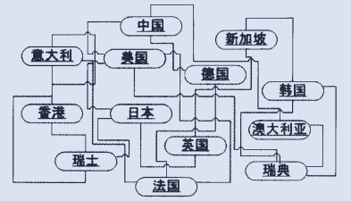
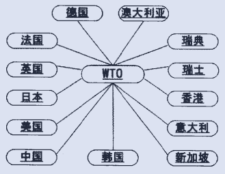

调停者模式（Mediator Pattern）是用来降低多个对象和类之间的通信复杂性的。这种模式提供了一个调停者类，用来充当“中心化”或“总线化”的角色，与各个对象通信，从而避免了其他对象之间的互相通信，从而降低了耦合度。

# 例子

生活中，调停者模式的例子是相当常见的，比如：

  * 一个是讲到调停者模式就避不开的关于同事之间沟通的例子。当我们身处一个大的团队中的时候，如果工作内容涉及许多同事，那么再互相沟通显然成本比较高。比如张三要结婚请婚假，手中的工作要暂时交接给李四、王五等五六个同事，分别跟他们单独沟通多麻烦，那么直接告知组长或经理就好了，由组长或经理协调一下工作给其他同事即可；
  * 你可能会说，沟通软件拉个群通知一下不行吗，当然可以，那这个时候，这个群就相当于一个“调停者”，任何人发送的消息都汇总到群里，其他群会员都可以收到消息。
  * 《Java与模式》中提到了关于WTO这种国际组织的例子，如果各个国家之间互相贸易，则互相耦合，结构复杂，如果都通过一个统一的贸易组织WTO来协调，则更加简单高效。下边两个图也是书中的，方便理解：

没有中心化的贸易组织时，各个国家直接互相耦合，为网状结构。

有了中心化的贸易组织后，各个国家不直接沟通，统一与WTO耦合，为星型结构。

通过以上例子，我们可以看出，调停者模式的作用在于：**通过增加中心化的对象，将网状的沟通结构变为星型结构，从而降低耦合度，提高灵活性。**

下面我们通过上边提到的第一个例子来看一下调停者模式如何实现：

假设有一个团队有两名开发熊二、张三，有一名测试李四，有一名运维王五。他们都归一个组长管，任何人有事情，比如请假、建议或技术分享，都需要先报告给组长，由组长统一安排。下面的故事始于张三请假：

首先是团队组员的抽象类：

TeamMember.java

    public abstract class TeamMember {
        // 团队角色
        public static final String RD = "开发人员";
        public static final String QA = "测试人员";
        public static final String OP = "运维人员";
    
        // 仅与自己的组长（调停者/中心角色）维护引用关系
        private TechLeader techLeader;
        private String name;
        protected String role;
        
        public TeamMember(String name) {
            this.name = name;
        }
    
        public String getName() {
            return name;
        }
    
        public void setTechLeader(TechLeader techLeader) {
            this.techLeader = techLeader;
        }
    
        // 向组长（调停者/中心角色）发送信息
        public void reportToLeader(String message) {
            techLeader.memberReport(this, message);
        }
    
        // 收到来自组长（调停者/中心角色）的消息
        public void tempTask(String task) {
            System.out.println("[" + role + "]" + name + "收到来自组长的安排： "  + task);
        }
    
        // 无伤大雅的方法，与模式无关
        public abstract void dailyWork();
    }

这里有几个与调停者模式相关的点：
  * 组员仅与组长（调停者/中心角色）维护引用关系，并不需要知道其他组员；
  * 既然是星型结构，那么沟通方式自然是组员与组长之间的双向沟通，组合可以发送消息给组长，也可以收到来自组长的消息（这里通常通过提供一个回调方法实现，比如`tempTask`）。

那么开发、测试和运维就是组员的具体实现了：

Developer.java

    public class Developer extends TeamMember {
    
        public Developer(String name) {
            super(name);
            this.role = TeamMember.RD;
        }
    
        public void dailyWork() {
            System.out.println("我是一个码农，我经常加班写代码，困了累了可能写出bug来。");
        }
    
    }

Tester.java

    public class Tester extends TeamMember {
    
        public Tester(String name) {
            super(name);
            this.role = TeamMember.QA;
        }
    
        public void dailyWork() {
            System.out.println("我是一名测试，我找出bug，确保代码质量。");
        }
    
    }

Operator.java

    public class Operator extends TeamMember {
    
        public Operator(String name) {
            super(name);
            this.role = TeamMember.OP;
        }
    
        public void dailyWork() {
            System.out.println("我是一个运维，保证系统稳定运行，如果有线上bug及时回滚，话说开发人员写的程序真不稳定。");
        }
    
    }

技术组长作为调停者，也就是星型结构的中心角色：

TechLeader.java

    public class TechLeader {
        // 维护有各个组员的引用
        private List<TeamMember> members;
    
        public TechLeader() {
            members = new ArrayList<TeamMember>();
        }
    
        public void addTeamMember(TeamMember teamMember) {
            members.add(teamMember);
            teamMember.setTechLeader(this);
        }
    
        public void memberReport(TeamMember reporter, String message) {
            if (message.contains("请假")) {
                reporter.tempTask("同意！");
                // 对相关人员发送消息或安排其执行操作
                for (TeamMember m : members) {
                    if (m.getName().equals(reporter.getName())) {
                        continue;
                    } else if (m.role.equals(TeamMember.RD)) {
                        m.tempTask(reporter.getName() + "请假了，期间请接手他的开发工作。");
                    } else if (m.role.equals(TeamMember.QA)) {
                        m.tempTask(reporter.getName() + "请假了，期间请将他的bug交由其他开发人员处理。");
                    } else if (m.role.equals(TeamMember.OP)) {
                        m.tempTask(reporter.getName() + "请假了，期间请将他的线上问题交由其他开发人员处理。");
                    }
                }
            } else if (message.contains("建议")) {
    
            } else if (message.contains("技术分享")) {
    
            }
        }
    }

关于调停者有两个点需要注意：
  * 既然是星型结构，那么调停者（组长）需要维护所有与之关联的节点（组员）的引用；通常也需要提供添加节点的功能；
  * 在收到某个节点的消息后，针对其他相关节点发送消息或调用其的某些回调方法（比如例子中给其他角色安排任务）。

最后我们测试一下：

Client.java

    public class Client {
        public static void main(String[] args) {
            TeamMember xionger = new Developer("熊二");
            TeamMember zhangsan = new Developer("张三");
            TeamMember lisi = new Tester("李四");
            TeamMember wangwu = new Operator("王五");
    
            TechLeader leader = new TechLeader();
            leader.addTeamMember(xionger);
            leader.addTeamMember(zhangsan);
            leader.addTeamMember(lisi);
            leader.addTeamMember(wangwu);
    
            // 张三请假
            zhangsan.reportToLeader("组长，世界很大，我想去看看，请假两天～");
        }
    }

张三向组长请假两天，组长收到报告后安排其他组员进行应对：

    [开发人员]张三收到来自组长的安排： 同意！
    [开发人员]熊二收到来自组长的安排： 张三请假了，期间请接手他的开发工作。
    [测试人员]李四收到来自组长的安排： 张三请假了，期间请将他的bug交由其他开发人员处理。
    [运维人员]王五收到来自组长的安排： 张三请假了，期间请将他的线上问题交由其他开发人员处理。

# 总结

通过回顾一下上边的例子，我们抽取出该设计模式的关键点：

  * 各个节点之间的网状耦合关系变为以调停者为中心的星型关系，其好处是明显的，因为随着节点数量的增加，网状关系的复杂度是以阶乘的速度增长的，而且网状关系中一个节点的增删都会设计到许多的改动。
  * 各个节点之间不在通信，全部与调停者进行双向的通信，所以各个节点仅维护调停者的引用即可，而调停者才需要维护所有节点的引用，不过注意调停者并不一定每次都要通知全部的节点。
  * 通常每个节点都要有通知调停者的方法，以及一个用于接收调停者消息的用于被调停者回调的方法。由于具有通用性和接口性质，这两个方法一般放在抽象类中。

**调停者模式的优点**

  * 松散耦合。调停者模式通过把多个节点对象之间的交互封装到调停者对象里面，从而使得节点对象之间松散耦合，基本上可以做到互补依赖。这样一来，节点对象就可以独立地变化和复用，而不再像以前那样“牵一处而动全身”了。
  * 集中控制交互。多个节点对象的交互，被封装在调停者对象里面集中管理，使得这些交互行为发生变化的时候，只需要修改调停者对象就可以了，当然如果是已经做好的系统，那么就扩展调停者对象，而各个节点类不需要做修改。
  * 多对多变成一对多。没有使用调停者模式的时候，节点对象之间的关系通常是多对多的，引入调停者对象以后，调停者对象和节点对象的关系通常变成双向的一对多，这会让对象的关系更容易理解和实现。

**调停者模式的缺点**

调停者模式的一个潜在缺点是，过度集中化。如果节点对象的交互非常多，而且比较复杂，当这些复杂性全部集中到调停者的时候，会导致调停者对象变得十分复杂，而且难于管理和维护。通过上边的例子也可以初见端倪，无论是请假、建议、技术分享等等所有的处理都要交给调停者，心疼组长一分钟～