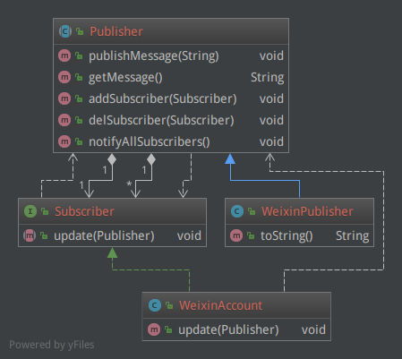
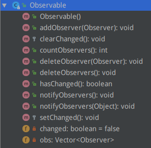

观察者（Observer）模式定义了一种一对多的依赖关系，让多个观察者对象同时监听某一个主题对象，主体对象的状态变化会通知所有观察者对象。观察者模式又叫做发布-订阅（Publish/Subscribe）模式、模型-视图（Model/View）模式、源-监听器（Source/Listener）模式或从属者（Dependents）模式。

这种模式在我们实际生活中并不鲜见，比如订牛奶、订报纸。我们订阅了某报纸之后，一旦报纸有新版出来，就会送到我们报箱或手中，去过取消订阅，那么也就再也收不到了。有了互联网之后，无论是微博好友还是微信订阅号，我们都可以“关注”和“取消关注”，关注了就可以收到信息推动。这些都是观察者模式的现实体现。

# 例子

以微信订阅号的关注和消息推送为例。

无论是微信的订阅号、微博的大V、喜马拉雅的音频专辑，都可以被关注或取消关注，当有新的文章、消息、音频作品出现的时候，订阅了的粉丝都会收到消息。所以我们可以抽象出来一个共同的抽象类`Publisher`来实现这些公共的方法：

Publisher.java

    public abstract class Publisher {
        private List<Subscriber> funs = new ArrayList<Subscriber>();
        private String message;
    
        public void publishMessage(String message) {
            this.message = message;
            notifyAllSubscribers();
        }
    
        public String getMessage() {
            return message;
        }
    
        public void addSubscriber(Subscriber subscriber) {
            funs.add(subscriber);
        }
        public void delSubscriber(Subscriber subscriber) {
            funs.remove(subscriber);
        }
        public void notifyAllSubscribers() {
            Iterator<Subscriber> it = funs.iterator();
            while (it.hasNext()) {
                it.next().update(this);
            }
        }
    }

可以看到，`Publisher`维护有一个订阅者的集合，当有新的内容更新时（其中`message`统一表示文章、信息或声音作品等各种形式的内容，由`publishMessage`更新内容），会调用`notifyAllSubscibers`方法来通知所有关注人。
这里要注意的是，这种通知是一种回调行为，也就是通过遍历并调用各个`subscriber`的`update`方法来进行通知。我们再来看一下`Subscriber`：

Subscriber.java

    public interface Subscriber {
        void update(Publisher publisher);
    }

可见`Subscriber`只规定了一种方法，那就是被回调的`update`。

具体来说，微信订阅号就是一种`Publisher`：

WeixinPublisher.java

    public class WeixinPublisher extends Publisher {
        private String dingyuehao;
    
        public WeixinPublisher(String dingyuehao) {
            this.dingyuehao = dingyuehao;
        }
    
        @Override
        public String toString() {
            return "微信订阅号[" + dingyuehao + "]";
        }
    }

而普通的微信用户——即关注者——就是`Subscriber`（通过继承实现）：

WeixinAccount.java

    public class WeixinAccount implements Subscriber {
        private String accountName;
    
        public WeixinAccount(String accountName) {
            this.accountName = accountName;
        }
    
        public void update(Publisher publisher) {
            System.out.println(accountName + "的微信收到了来自" + publisher + "的推送文章： " + publisher.getMessage());
        }
    }

微信用户实现了具体的`update`方法，定义了在收到通知后要做哪些操作，比如阅读、转发等等，这里通过打印一行文字来表示。

我们来看一下效果：

Client.java

    public class Client {
        public static void main(String[] args) {
            WeixinPublisher publisher = new WeixinPublisher("享学IT");
            publisher.addSubscriber(new WeixinAccount("张三"));
            publisher.addSubscriber(new WeixinAccount("李四"));
            publisher.addSubscriber(new WeixinAccount("王五"));
    
            publisher.publishMessage("Java设计模式百例-观察者模式");
        }
    }

张三或李四执行“关注”操作后，微信订阅号执行`addSubscriber`操作将他们添加到自己的订阅者名单中，当发布新消息时，订阅者都可以收到，我们看一下输出：

    张三的微信收到了来自微信订阅号[享学IT]的推送文章： Java设计模式百例-观察者模式
    李四的微信收到了来自微信订阅号[享学IT]的推送文章： Java设计模式百例-观察者模式
    王五的微信收到了来自微信订阅号[享学IT]的推送文章： Java设计模式百例-观察者模式

# 总结

例子看完后，用一个类图“鸟瞰”一下类和接口关系就比较清晰了：

抱歉，这个类关系图的布局不是很直观，但是有几个观察者模式的特点是可以总结出来的：
1. 观察者模式是一个一对多的关系，一个被观察者对应多个观察者，这种关系通过在被观察者内维护一个观察者的集合来实现。
2. 但是与“被围观”不同的是，被观察者拥有添加和删除观察者的方法，主动权在自己手中。
2. 当被观察者状态有变动时，也是由被观察者主动通知自己维护的“名单”中的各个观察者，通知是采用回调接口方法的方式。

## Java内置观察者模式

由于观察者模式应用广泛，Java内置了观察者模式的抽象类和接口：

被观察者 Observable.java

可以看到其中的关键方法`addObserver`、`deleteObserver`和`notifyObservers`。这样，上边的例子就不用自己写抽象类`Publisher`了，直接使用`Observable`即可。

观察者 Observer.java 接口也是同样的，不过`update`方法的参数更加具有普适性：

public interface Observer {
    void update(Observable o, Object arg);
}

其中，第二个参数`arg`是`Observable.notifyObservers(Object)`方法的参数传过来的内容。

使用模式与咱们的例子是一样的：

偷懒截了《Java与模式》的图。

大家在看源码的时候如果发现了类名类似`XxxObserver`或`XxxListener`这样的类时，不妨看一下，有可能就是应用了观察者模式。