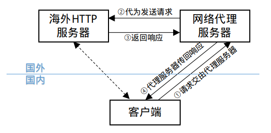
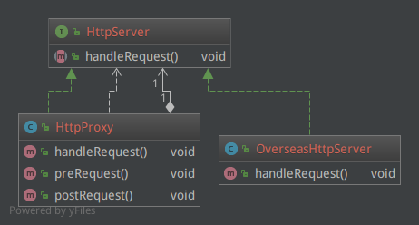
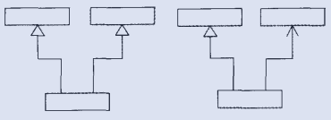
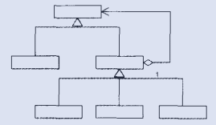

代理模式（Proxy Pattern）为指定的类的对象提供代理对象，并通过代理对象对原对象的引用，代理后者执行操作。

咱们搞技术的，大多都需要用到网络代理服务，毕竟国外有丰富最新的IT资料，而国内的网络环境你懂得。不同的代理服务，由于协议和技术不同，原理也有差异，但大体思路都差不多。

如图，作为客户端的我们，当想访问海外的某台HTTP服务的时候，由于墙，网页打不开，这时候就需要网络代理服务，我们在自己电脑上安装一个代理客户端，这个代理客户端就能够将我们对那台海外HTTP服务器的请求转送至同样位于国外的网络代理服务器上，由于代理服务器在国外，因此访问海外HTTP服务器没问题，于是代为发送请求，并将收到的响应内容再传回给我们自己电脑，这样我们就相当于可以访问国外技术资料了。

# 例子
## 静态代理

那么我们就以这个为例，写一个简单的代理模式的代码。

首先，我们看，无论是海外HTTP服务还是网络代理服务器，对于我们来说，都是HTTP服务器，都能够接收HTTP请求，并返回相应的结果页面。我们并不关心如何进行的代理，实际上我们也不清楚它的具体原理和实现，我们只关心HTTP服务功能。于是我们的需求可以用以下接口来概况：

HttpServer.java

    public interface HttpServer {
        void handleRequest();
    }

我们想访问的那个海外网站的HTTP服务器就是一个具体实现：

OverseasHttpServer.java

    public class OverseasHttpServer implements HttpServer {
        public void handleRequest() {
            System.out.println("海外的HTTP服务器处理请求并返回结果...");
        }
    }

我们来看一下代理服务器：

HttpProxy.java

    public class HttpProxy implements HttpServer {
        private HttpServer overseasHttpServer;
    
        public HttpProxy(HttpServer overseasHttpServer) {
            this.overseasHttpServer = overseasHttpServer;
        }
    
        public void handleRequest() {
            preRequest();
            this.overseasHttpServer.handleRequest();
            postRequest();
        }
    
        public void preRequest() {
            System.out.println("拦截客户端的HTTP请求，发送至海外的代理服务器，由其向海外HTTP服务器发送请求...");
        }
        public void postRequest() {
            System.out.println("海外代理服务其接收海外HTTP服务器反馈的结果，发送回客户端浏览器进行显示...");
        }
    }

代理服务器也实现了`HttpServer`，这也很好理解，毕竟我们需要的是一个HTTP服务器，无论你是实际的，还是代理的，能够处理请求就好了，别的我不care～这是代理模式的第一个特点，那就是**代理类同被代理类一样，都实现同样的接口，以便对外提供同样的服务**。

但是代理服务器毕竟只是一个中转，它**必须要引入被代理服务器作为成员变量来执行核心的操作**。此外，代理服务器可以在核心操作前后进行一些其他工作，以便更好的提供服务。

测试一下代理效果：

Client.java

    HttpServer overseasHttpServer = new OverseasHttpServer();
    HttpServer httpServer = new HttpProxy(overseasHttpServer);
    httpServer.handleRequest();

输出为：

    拦截客户端的HTTP请求，发送至海外的代理服务器，由其向海外HTTP服务器发送请求...
    海外的HTTP服务器处理请求并返回结果...
    海外代理服务其接收海外HTTP服务器反馈的结果，发送回客户端浏览器进行显示...

可见确实是按照我们上边介绍的原理执行的HTTP代理服务。

## 动态代理

不知您是否用过Spring进行开发，Spring以及其他的一些开发框架，都提供了面向切面开发（AOP）的能力。

举个栗子，我们开发一个系统，首先要关心的是业务功能，而对于像记录日志这样的功能，通常是作为系统基础能力由框架提供。这样理想的效果就是，开发人员只需要开发功能就好，记录日志的功能由框架“切入”到具体业务方法的前后来实现。

这其实类似于我们刚才提到的代理的例子，有`pre`和`post`的处理。但是对于框架来说，并不知道会增加什么样的业务类和业务操作，需要动态为业务类的具体业务操作提供代理，而不是交由业务类的开发人员对每个业务类开发相应的代理类，且不说提高了不少的开发量，如果哪天除了日志再增加一个权限处理的基础能力，还要对所有的代理类进行补充，岂不是要撞墙了。

Spring的AOP借助了Java语言提供的动态代理机制对业务方法进行动态代理。当然Spring也对AspectJ这种功能更加强大的切面处理库进行了集成，本文不表。

对于动态代理来说，需要首先有一个实现`InvocationHandler`接口的handler，可以简单认为是对被代理的方法的包装。

HttpProxyHandler.java

    public class HttpProxyHandler implements InvocationHandler {
        private HttpServer overseasHttpServer;
    
        public HttpProxyHandler(HttpServer overseasHttpServer) {
            this.overseasHttpServer = overseasHttpServer;
        }
    
        public Object invoke(Object proxy, Method method, Object[] args) throws Throwable {
            preRequest();
            Object o = method.invoke(overseasHttpServer, args);
            postRequest();
            return o;
        }
    
        public void preRequest() {
            System.out.println("拦截客户端的HTTP请求，发送至海外的代理服务器，由其向海外HTTP服务器发送请求...");
        }
        public void postRequest() {
            System.out.println("海外代理服务其接收海外HTTP服务器反馈的结果，发送回客户端浏览器进行显示...");
        }
    }

这里，Handler中仍然需要引用被代理类的对象作为成员变量，甚至可以将成员变量直接声明为`Object`类型，从而代理类可以为更多业务类提供代理，如下：

    public class ProxyHandler implements InvocationHandler {
        private Object obj;
    
        public ProxyHandler(Object obj) {
            this.obj = obj;
        }
    
        public Object invoke(Object proxy, Method method, Object[] args) throws Throwable {
            preRequest();
            Object o = method.invoke(obj, args);
            postRequest();
            return o;
        }
        
        public void preInvoke() {}
        public void postInvoke() {}
    }

这样，可以由子类覆盖`preInvode()`和`postInvoke()`，从而实现`HttpProxyHandler`和`HttpsProxyHandler`等等，用来具体定义Http和Https协议分别如何进行代理。这里其实有了模板模式的影子，这两个空方法就是模板元素。我们言归正传，仍然使用上一段代码继续我们的例子。

我们看`InvocationHandler`的`invoke(Object proxy, Method method, Object[] args)`方法，`proxy`指的是动态生成的代理对象，`method`指的是被代理的操作方法，`args`指的是被代理方法的参数。可见Java语言的动态代理机制都已经给准备好了，我们只需要执行`method.invoke(obj, args)`就相当于被代理的对象执行了被代理的方法。

Handler有了，那么动态代理的对象怎么生成的呢？Java提供了`Proxy`工具类`newProxyInstance(ClassLoader loader, Class<?>[] interfaces, InvocationHandler h)`来生成代理对象。其中第一个参数`loader`是类加载器，通常使用被代理类的类加载器即可；第二个参数`interfaces`是被代理类所实现的接口类数组，可见这种代理方式仍然是基于接口代理的，第三个参数就是我们刚刚准备好的handler。

这个方法会返回一个代理对象，这个对象实现了`interfaces`指定的接口，因此可以转换类型，然后就可以同静态代理一样的方式来使用了。

Client.java

    HttpProxyHandler proxy = new HttpProxyHandler(overseasHttpServer);
    HttpServer httpProxy = (HttpServer) Proxy.newProxyInstance(proxy.getClass().getClassLoader(), 
        overseasHttpServer.getClass().getInterfaces(), proxy);
    httpProxy.handleRequest();

# 总结

关于代理模式，不用说太多，一图胜千言啊：

其特点有二：1. 代理类与被代理类基于同样的接口；2. 代理类引用了被代理类。

这个模式容易与其他模式混淆，比如适配器模式：

这两个分别是类适配器模式和对象适配器模式，尤其是对象适配器模式更像，但它们有本质的区别，那就是，适配器类和被适配的类并不基于同样的接口，而这正是“适配器”的用意所在——适配不同的接口。

还有装饰器模式：

这俩就更像了，对装饰器模式来说，装饰者（decorator）和被装饰者（decoratee）都实现同一个 接口。对代理模式来说，代理类（proxy class）和真实处理的类（real class）都实现同一个接口。此外，不论我们使用哪一个模式，都可以很容易地在真实对象的方法前面或者后面加上自定义的方法。

这两个模式从类关系上看，确实相差不多，但是主要区别在于应用场景和目的，装饰器模式应当为所装饰的对象提供增强功能，而代理模式对被代理的对象施加控制，并不提供对对象本身的增强。
