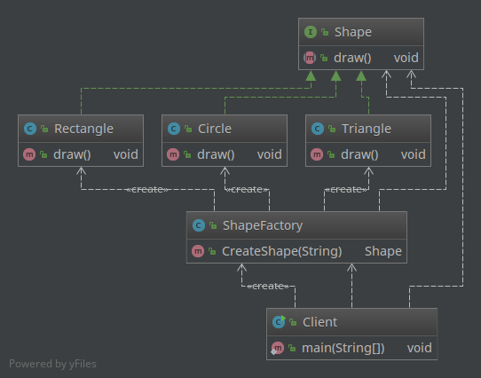
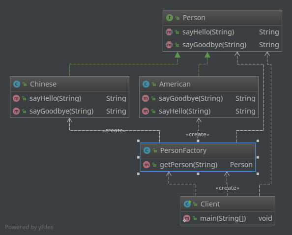

工厂模式（Factory Pattern）是 Java 中最常用的设计模式之一。这种类型的设计模式属于创建型模式，它提供了一种创建对象很好的方式。具体来说，有简单工厂模式（simple factory）、工厂方法模式（factory method)和抽象工厂模式（abstract factory）等模式。
本篇先从简单工厂模式谈起。

# 例子
请设想一个简单的需求，你在做一个画图软件，可以画矩形、三角形和圆形等，每一种图形都用一个类来管理：  
  * `Rectangle`
  * `Circle`
  * `Triangle`
每个类都有各自的`draw()`方法，当需要画某种图形的时候就可以：  

Client.java

    // 画矩形时：
    Rectangle r = new Rectangle();
    r.draw();
    // 画圆形时：
    Circle c = new Circle();
    c.draw();
    // 画三角形时：
    Triangle t = new Triangle();
    t.draw();

如果这时增加一个`Star`类型的图形，就得需要增加一个`new Star()`来获取对象，这显然是不符合开闭原则。所谓开闭原则，即对扩展开放，对修改关闭。

要想实现开闭原则，就需要考虑把创建对象的过程统一起来，并且能够满足扩展图形类型的需要。我们自然而然地就能想到这些图形都是有共同点可以抽象的，它们都实现了`draw()`方法，因此可以增加一个共同的接口，即“针对接口编程，依赖于抽象而不依赖于具体”，这就是“依赖倒转”的原则。

Shape.java

    public interface Shape {
       void draw();
    }

Rectangle.java

    public class Rectangle implements Shape {
       @Override
       public void draw() {
          System.out.println("Draw a rectangle.");
       }
    }

Triangle.java

    public class Triangle implements Shape {
       @Override
       public void draw() {
          System.out.println("Draw a triangle.");
       }
    }

Circle.java

    public class Circle implements Shape {
       @Override
       public void draw() {
          System.out.println("Draw a circle.");
       }
    }

然后屏蔽掉具体类型的创建语句，那么就可以一定程度上做到“开闭原则”了。这时就需要工厂类登场了，它有一个用来返回具体产品对象的方法，注意这个方法是静态（static）的，也因此简单工厂模式有时候也被叫做“静态工厂模式”。

ShapeFactory.java

    public class ShapeFactory {
       //使用 getShape 方法获取形状类型的对象
       public static Shape getShape(String shapeType){
          if(shapeType == null){
             return null;
          }        
          if(shapeType.equalsIgnoreCase("CIRCLE")){
             return new Circle();
          } else if(shapeType.equalsIgnoreCase("RECTANGLE")){
             return new Rectangle();
          } else if(shapeType.equalsIgnoreCase("TRIANGLE")){
             return new Triangle();
          }
          return null;
       }
    }

有了工厂类，再画图的时候刚才的`Client.java`就可以改一改了：

Client.java

    //画矩形时:
    Shape r = ShapeFactory.getShape("RECTANGLE");
    r.draw();
    //画圆形时:
    Shape c = ShapeFactory.getShape("CIRCLE");
    c.draw();
    //画三角形时:
    Shape t = ShapeFactory.getShape("TRIANGLE");
    t.draw();

此时如果增加一个Star的图形类型，也可以从容应对了，从使用者`Client`的角度，无需关心对象是如何创建的。
各个类之间的关系如下：

此外还有一个类似的例子，可自行查看源码：

看到这里可能你会觉得，前后两个版本的`Client`并没有太大的不同，反而采用了工厂模式后更加复杂了。其实作为一种创建类模式，在任何需要生成复杂对象的地方，都可以使用工厂方法模式。有一点需要注意的地方就是**复杂对象适合使用工厂模式，而简单对象，特别是只需要通过 new 就可以完成创建的对象，无需使用工厂模式。如果使用工厂模式，就需要引入一个工厂类，会增加系统的复杂度。**

此外，在具体使用时，也会有不同的调整，比如：
1. `ShapeFactory`的`getShape(String)`方法也可以改为非`static`的，这样就需要首先构造一个实际的工厂对象来创建产品了；
2. 工厂类、抽象产品和具体产品这三个角色有可能部分或全部合并，我们来看一个Java中经常用到的关于日期类型格式化的例子：

    import java.util.*;  
    import java.text.*;  
    class DateTest  
    {  
        public static void main(String[] args)  
        {  
            Locale local = Locale.FRENCH;  
            Date date = new Date();  
            String now = DateFormat.getTimeInstance(DateFormat.DEFAULT,local).format(date);  
            System.out.println(now);  
            try  
            {  
                date = DateFormat.getDateInstance(DateFormat.DEFAULT,local).parse("16 nov. 01");  
                System.out.println(date);  
            }  
            catch (ParseException e)  
            {  
                System.out.println("Parsing exception:" + e);  
            }  
        }  
    }  

而我们知道DateFormat是个抽象类，`public final static DateFormat getDateInstance(...)`的静态方法，也使得它自身既是一个抽象产品角色，又是一个工厂类角色，完成具体产品角色的创建（比如`SimpleDateFormat`）。

如果三个角色全部合并，其实就是一个类，增加了一个创建自身对象的方法。

# 总结
在工厂模式中，我们在创建对象时不会对客户端暴露创建逻辑，并且是通过使用一个共同的接口来指向新创建的对象。

**使用场景**： 1、日志记录器：记录可能记录到本地硬盘、系统事件、远程服务器等，用户可以选择记录日志到什么地方。 2、数据库访问，当用户不知道最后系统采用哪一类数据库，以及数据库可能有变化时。 3、设计一个连接服务器的框架，需要三个协议，"POP3"、"IMAP"、"HTTP"，可以把这三个作为产品类，共同实现一个接口。

**优点**： 一个调用者想创建一个对象，只要提出要求就可以了；屏蔽产品的具体实现，调用者只关心产品的接口；一定程度上提高了扩展性。

**缺点**：每次增加一个产品时，都需要增加一个具体类和对象实现工厂，使得系统中类的个数成倍增加，在一定程度上增加了系统的复杂度，同时也增加了系统具体类的依赖。可见，简单工厂模式对"开-闭"原则的支持还不够，因为如果有新的产品加入到系统中去，就需要修改工厂类，将必要的逻辑加入到工厂类中。

