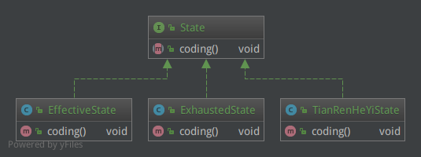

在状态模式（State Pattern）中，类的行为是基于它的状态改变的。这种类型的设计模式属于行为型模式。

我们程序猿在码代码的时候由于不同的工作状态，可能写出质量不一的代码，并我们不是AI嘛。

  * 早上上班的时候，休息了一夜，精力旺盛，程序猿能够高效码代码，bug也不多；
  * 当熬夜加班的时候，运转了一天的大脑无比疲惫，写出的代码常有bug出没；
  * 当然，我们也都非常期待在码代码的时候能够达到“天人合一”之境界（虽然这种状态通常出现在玩游戏时），没有烦人的会议、没有别人的打扰，虽然没有程序猿鼓励妹子在侧，却能几分钟写出通常需要几个小时才能写出的逻辑，解决近几天都未解决的问题，可谓“码神附体”！

# 例子

如果上述情况用代码来表述的话，我们来设计一下。

**程序猿还是同一个人，但是同一个任务在不同的状态下，可能会达到不同的效果。**

注意上边这句话，有两个“同一个”和两个”不同的“。

人和任务是相同的，是不变的部分；状态和效果是不同的，是变的部分。按照设计模式的套路，不变的和变化的是要分开来的，从而满足”开闭“原则，有利于扩展。

不变的是人（类`Developer`）和任务（方法`Developer.develop()`），变化的状态（类`XxxState`）作为`Developer`的成员变量能够随时切换看来就可以解决这个问题。

由于状态是变化的，因此需要不同的类`XxxState`来描述，其方法`XxxState.develop()`正好可以灵活实现不同状态下的工作效果。

完美！最后还有一个，按照设计模式的通常套路，同一类变化的类要抽象为接口或抽象类，并提供统一的接口方法，从而做到”面向接口“编程，以应对变化。

设计完毕，那就开工：

Developer.java

    public class Developer {
        private State state;
    
        public Developer(State state) {
            this.state = state;
        }
    
        public void setState(State state) {
            this.state = state;
        }
    
        public void develop() {
            state.coding();
        }
    }

`Developer`维护有`State`的引用，并提供`setState(State)`方法切换状态。

State.java

    public interface State {
        void coding();
    }

EffectiveState.java

    public class EffectiveState implements State {
        public void coding() {
            System.out.println("高效码代码，偶有bug，人非圣贤嘛～");
        }
    }

ExhaustedState.java

    public class ExhaustedState implements State {
        public void coding() {
            System.out.println("加班熬夜码代码，专业写bug");
        }
    }

TianRenHeYiState.java

    public class TianRenHeYiState implements State {
        public void coding() {
            System.out.println("写代码进入天人合一境界，仿佛三头六臂，码神附体");
        }
    }

不同的状态有不同的实现效果，通过`State`抽象出统一的接口。

测试一下：

Client.java

    public class Client {
        public static void main(String[] args) {
            Developer developer = new Developer(new EffectiveState());
            developer.develop();
            developer.setState(new ExhaustedState());
            developer.develop();
            developer.setState(new TianRenHeYiState());
            developer.develop();
        }
    }

使用`Developer`的`setState`方法切换不同的状态，从而实现不同的操作：

    高效码代码，偶有bug，人非圣贤嘛～
    加班熬夜码代码，专业写bug
    写代码进入天人合一境界，仿佛三头六臂，码神附体

# 总结

这就是状态模式，将不同的状态包装为不同的类，供其本体引用，从而实现灵活的状态切换。

看到这里其实感觉状态模式和策略模式很像，状态模式是将不同的状态对象作为成员变量给使用者（也称”环境“），策略模式是将不同的策略对象作为成员变量给使用者（也称”环境“）。其实二者还是有些使用上的区别的：

  * 策略模式中，作为成员变量的策略对象通常不会经常变化；而状态模式在使用者（也称”环境“）的整个生命周期中会不断变化。
  * 策略模式中，通常并不明确告诉客户端所选择的具体策略；而状态模式中，所处的状态是明确告知客户端的；
  * 通常策略模式的使用者自己选择一个具体策略；而状态模式的使用者（也称”环境“）通常是被动使用某种状态。

**使用场景**

  * 一个对象的行为依赖于它所处的状态，对象的行为必须随着其状态的改变而改变；
  * 对象在某个方法里依赖一重或多重的条件转移语句，而且其中有大量代码的时候。

**注意事项**

  * 状态模式并未规定哪个角色来进行状态切换，上边的例子是由使用者（也称”环境“）的`setState`方法来切换状态，而有些情况下是由”状态“对象本身来切换到下一个状态。
  * 使用者（也称”环境“）也可以把自己作为参数传递给状态对象，从而状态对象也可以调用使用者的方法。